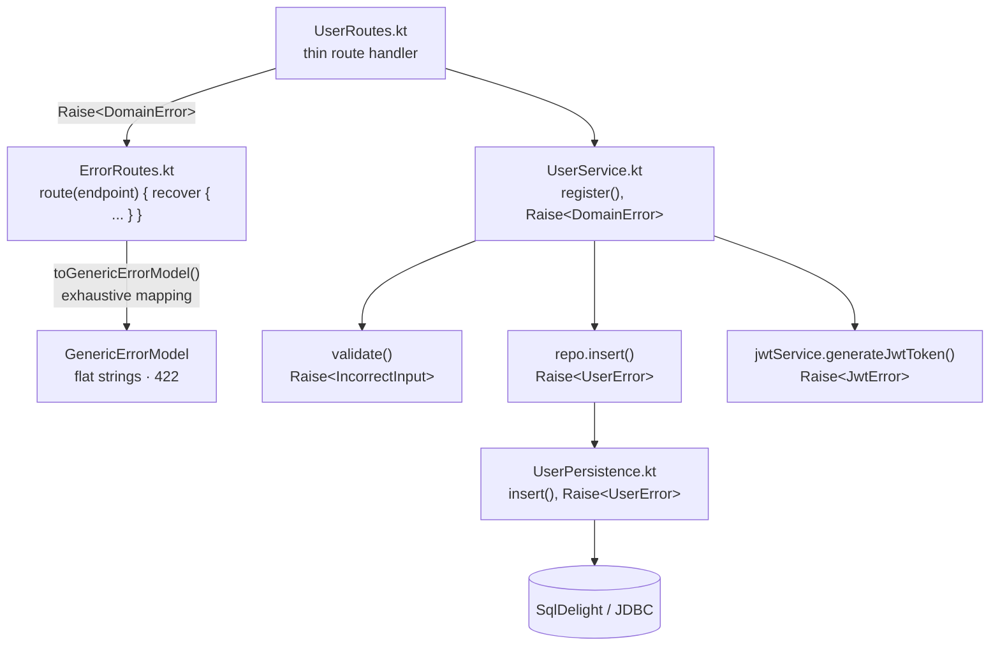

# End-to-end feature walkthrough

A nice way to understand this project is to follow one feature all the way through the
stack. So let's take user registration and trace it from the HTTP contract, through
validation and persistence, and back to the response.

Along the way we'll see the main idea of the codebase: keep the public API compatible
with the RealWorld spec, but model the internals with precise typed errors.

---

## The design goal

The [RealWorld specification](https://github.com/gothinkster/realworld) defines one
error response shape for every endpoint:

```json
{
  "errors": {
    "body": ["error one", "error two"]
  }
}
```

In this project that shape is `GenericErrorModel`:

```kotlin
@Serializable data class GenericErrorModel(val errors: GenericErrorModelErrors)
@Serializable data class GenericErrorModelErrors(val body: List<String>)
```

This is not my favorite error model. It gives us a flat `List<String>`, no error code,
no field-level structure, and no way for a client to distinguish `EmailAlreadyExists`
from `PasswordNotMatched` without parsing text.

However, that is the contract we have to implement.

So the interesting question is: can we keep this wire format and still write a precise
application internally? The answer is yes. We model rich domain errors in the core, and
only convert them to `GenericErrorModel` at the HTTP boundary.

This means the compiler helps us inside the application, while the outside world still
sees exactly what the RealWorld spec expects.

---

## Step 1: declare the endpoint contract

Every endpoint is declared as data in `Api.kt` using Spine's resource/endpoint DSL. The
route handler does not decide its own path, request body, response body, or error shape.
It implements a contract that already exists:

```kotlin
object Api : SpineRootResource("api") {
    object Users : StaticResource<Api>("users", Api) {
        val register by post()
            .request<UserWrapper<NewUser>>()
            .response<UserWrapper<User>>()
            .failure<GenericErrorModel>(HttpStatusCode.UnprocessableEntity)
    }
}
```

Let's read this as a type-level HTTP contract:

- `.request<UserWrapper<NewUser>>()` is the JSON body we expect.
- `.response<UserWrapper<User>>()` is the success body we produce.
- `.failure<GenericErrorModel>(HttpStatusCode.UnprocessableEntity)` is the failure body
  and status code.

This is where the RealWorld constraint is encoded. On failure, registration returns a
`GenericErrorModel` with status `422`. The rest of the codebase does not need to care
about that shape yet.

---

## Step 2: define precise domain errors

Inside the application we use a sealed hierarchy rooted at `DomainError`:

```kotlin
sealed interface DomainError

sealed interface ValidationError : DomainError
data class IncorrectInput(val errors: NonEmptyList<InvalidField>) : ValidationError

sealed interface UserError : DomainError
data class EmailAlreadyExists(val email: String) : UserError
data class UsernameAlreadyExists(val username: String) : UserError
data object PasswordNotMatched : UserError
data class UserNotFound(val property: String) : UserError

sealed interface JwtError : DomainError
data class JwtGeneration(val description: String) : JwtError
data class JwtInvalid(val description: String) : JwtError
```

These types carry the data we actually need. Which email already exists? Which username
was taken? Which fields failed validation?

That information would be lost if we used `List<String>` everywhere. By keeping the
rich model in the domain, the compiler can also check that every `DomainError` is
handled when we finally translate it to the wire format.

---

## Step 3: keep persistence errors narrow

`UserPersistence.insert` only knows about user-related failures. It can raise
`EmailAlreadyExists` or `UsernameAlreadyExists`, so its context is `Raise<UserError>`:

```kotlin
context(_: Raise<UserError>)
fun insert(username: String, email: String, password: String): UserId {
    val salt = generateSalt()
    val key = generateKey(password, salt)
    return catch({
        usersQueries
            .insertAndGetId(
                username = username,
                email = email,
                salt = salt,
                hashed_password = key,
                bio = "",
                image = "",
            )
            .executeAsOne()
    }) { e: PSQLException ->
        raiseUniqueViolation(e, username, email)
    }
}
```

`catch` converts a `PSQLException` into a typed `raise` when it is an expected domain
failure. The helper looks at the PostgreSQL constraint name and raises the matching
`UserError`:

```kotlin
context(_: Raise<UserError>)
private fun raiseUniqueViolation(
    exception: PSQLException,
    username: String?,
    email: String?,
): Nothing =
    when (exception.serverErrorMessage?.constraint) {
        "users_username_key" -> raise(UsernameAlreadyExists(username.orEmpty()))
        "users_email_key" -> raise(EmailAlreadyExists(email.orEmpty()))
        else -> throw exception
    }
```

Notice the `else -> throw exception`. Unknown database failures are not domain errors.
They are unexpected failures, and we should not pretend otherwise.

This is a small but important distinction: `Raise` is used for expected logical errors,
not as a replacement for exceptions everywhere.

---

## Step 4: let service errors widen naturally

`UserService.register` composes validation, persistence, and JWT generation:

```kotlin
context(_: DomainErrors)
fun register(input: RegisterUser): JwtToken {
    val (username, email, password) = input.validate()
    val userId = repo.insert(username, email, password)
    return jwtService.generateJwtToken(userId)
}
```

Here `DomainErrors` is just a typealias for `Raise<DomainError>`.

The interesting part is what we do *not* write. There is no `try/catch`, no `mapLeft`,
and no manual lifting from `UserError` to `DomainError`. Since `IncorrectInput`,
`UserError`, and `JwtError` are all subtypes of `DomainError`, the narrower calls fit
inside the wider context.

Errors stay narrow at the leaves and widen at the composition point. That's exactly
what we want.

Compare that with a service method that only delegates to a narrow persistence call:

```kotlin
context(_: Raise<UserNotFound>)
fun getUser(userId: UserId): UserInfo = repo.select(userId)
```

`getUser` does not use `Raise<DomainError>` because it has no reason to. Keeping this
narrow tells callers, and the compiler, exactly what can go wrong.

---

## Step 5: accumulate validation errors

Before registration touches the database, we validate the incoming data. Validation uses
Arrow's `accumulate` pattern so an API consumer gets all field errors at once, not just
the first one:

```kotlin
context(_: Raise<IncorrectInput>)
fun RegisterUser.validate(): RegisterUser =
    withError(::IncorrectInput) {
        accumulate {
            val username by accumulating { username.validUsername() }
            val email by accumulating { email.validEmail() }
            val password by accumulating { password.validPassword() }
            RegisterUser(username, email, password)
        }
    }
```

Each field can also accumulate multiple rule failures internally:

```kotlin
context(_: Raise<NonEmptyList<String>>)
private fun String.passwordRules(): String = accumulate {
    notBlank()
    minSize(MIN_PASSWORD_LENGTH)
    maxSize(MAX_PASSWORD_LENGTH)
    this@passwordRules
}
```

So if the password is blank and too short, both messages are preserved. If the email and
username are invalid too, those fields are preserved as well.

The shape mirrors our domain model:

```text
IncorrectInput
  -> NonEmptyList<InvalidField>
       -> NonEmptyList<String>
```

Nothing is flattened until the very last step.

> See the [Validation tutorial](validation.md) for the full breakdown of
> `accumulate`, `accumulating`, and `ensureOrAccumulate`.

---

## Step 6: keep the route handler thin

The route handler destructures the request body, calls the service, and responds:

```kotlin
fun Route.userRoutes(userService: UserService, jwtService: JwtConfig<JwtContext>) {
    route(Api.Users.register) {
        val (username, email, password) = body.user
        val token = userService.register(RegisterUser(username, email, password))
        respond(UserWrapper(User(email, token.value, username, "", "")), HttpStatusCode.Created)
    }
}
```

There is no error handling in this handler.

That is intentional. Every route in this project uses the custom `route` function from
`ErrorRoutes.kt`, which runs the handler in a `Raise<DomainError>` context and recovers
errors in one place.

---

## Step 7: translate once at the edge

`ErrorRoutes.kt` defines the route overload used by the handlers:

```kotlin
inline fun <...> Route.route(
    endpoint: Endpoint<In, Out, Failure, Params>,
    crossinline block: suspend context(DomainErrors) TypedResponseScope<...>.() -> Unit,
): Unit = route(endpoint) response@{
    recover(
        block = { block() },
        recover = { error: DomainError -> fail(error.toGenericErrorModel()) },
    )
}
```

This is the only place where `DomainError` becomes `GenericErrorModel`.

`recover` runs the route handler. If validation, persistence, or JWT generation raises a
`DomainError`, we call `toGenericErrorModel()` and pass the result to Spine's `fail`.
Spine then serializes the failure using the `422` status declared in `Api.kt`.

The mapping itself is an exhaustive `when`:

```kotlin
fun DomainError.toGenericErrorModel(): GenericErrorModel =
    when (this) {
        PasswordNotMatched ->
            GenericErrorModel(GenericErrorModelErrors(listOf("Password not matched")))

        is IncorrectInput ->
            GenericErrorModel(
                GenericErrorModelErrors(
                    this.errors.map { field ->
                        "${field.field}: ${field.errors.joinToString()}"
                    }
                )
            )

        is EmailAlreadyExists ->
            GenericErrorModel(
                GenericErrorModelErrors(listOf("${this.email} is already registered"))
            )

        // ... every other DomainError variant
    }
```

Because `DomainError` is sealed, adding a new variant produces a compile error here
until we decide how it should look in the RealWorld response. That is the compiler doing
useful work for us.

---

## The full picture



The route starts with the RealWorld contract, the domain stays precise, and the error is
flattened only at the boundary.

This is the trade-off I like in Kotlin services: be pragmatic about the API we have to
serve, but let the compiler protect the code we actually own.

---

## Where to go next

- [Validation tutorial](validation.md): a deeper look at `accumulate` and
  `ensureOrAccumulate`.
- [Project setup](project-setup.md): how the server boots and how resources are wired.
- [Architecture overview](../index.md#architecture): how the codebase is organized.

Thank you for reading! In the next tutorial we zoom in on validation, where the
fail-fast `Raise` DSL and accumulating errors work together nicely.
