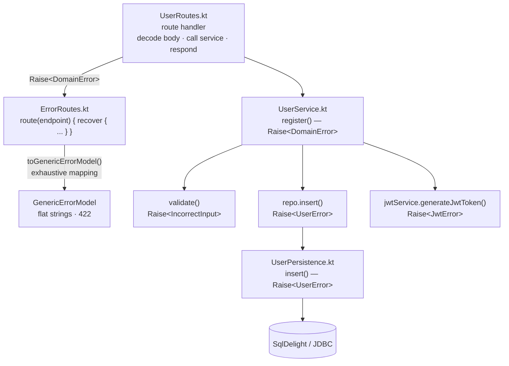

# End-to-end feature walkthrough

This tutorial traces a single feature — user registration — from the HTTP contract down
to the database and back up through error handling, showing how Spine routes, Arrow's
`Raise`, and the `DomainError` hierarchy fit together.

---

## The design goal

The [RealWorld specification](https://github.com/gothinkster/realworld) defines a single
error response shape for every endpoint:

```json
{
  "errors": {
    "body": ["error one", "error two"]
  }
}
```

That shape is `GenericErrorModel` in this codebase:

```kotlin
@Serializable data class GenericErrorModel(val errors: GenericErrorModelErrors)
@Serializable data class GenericErrorModelErrors(val body: List<String>)
```

This is a mediocre specification in terms of error modeling. Every endpoint returns the
same flat bag of strings regardless of what went wrong — the client cannot
programmatically distinguish "password too short" from "email already taken" without
parsing human-readable text. There is no error code, no field-level structure, and no
status-code variation.

One of the goals of this project was to take that mediocre wire format as a given
constraint and still build a high-quality core with precise, compiler-checked errors.
The mapping from rich domain errors to `GenericErrorModel` happens once, at the very
edge of the application, so the entire service and persistence layer benefits from
typed errors even though the API never exposes them.

The result: internally, the compiler enforces that every error case is handled
exhaustively. Externally, the API stays compliant with the RealWorld spec. The two
concerns never leak into each other.

---

## Step 1: declare the endpoint contract

Every endpoint is declared as data in `Api.kt` using Spine's resource/endpoint DSL.
The route handler never decides its own path, status code, or error shape — it
implements a contract that is already fully specified:

```kotlin
object Api : SpineRootResource("api") {
    object Users : StaticResource<Api>("users", Api) {
        val register by
            post()
                .request<UserWrapper<NewUser>>()
                .response<UserWrapper<User>>()
                .failure<GenericErrorModel>(HttpStatusCode.UnprocessableEntity)
    }
}
```

Key points:

- `.request<UserWrapper<NewUser>>()` — the expected JSON body, deserialized
  automatically.
- `.response<UserWrapper<User>>()` — the success response body.
- `.failure<GenericErrorModel>(HttpStatusCode.UnprocessableEntity)` — the error
  payload and HTTP status. Every endpoint in this codebase uses the same failure
  declaration because the RealWorld spec mandates a uniform error shape.

This is where the "mediocre specification" constraint is encoded. The contract says:
"on failure, return `GenericErrorModel` at 422." The rest of the system does not need
to know or care about that.

---

## Step 2: define precise domain errors

Inside the application, errors are modeled as a sealed hierarchy rooted at
`DomainError`. Each feature adds its own sealed group:

```kotlin
sealed interface DomainError

sealed interface ValidationError : DomainError
data class IncorrectInput(val errors: NonEmptyList<InvalidField>) : ValidationError

sealed interface UserError : DomainError
data class EmailAlreadyExists(val email: String) : UserError
data class UsernameAlreadyExists(val username: String) : UserError
data object PasswordNotMatched : UserError
data class UserNotFound(val property: String) : UserError

sealed interface JwtError : DomainError
data class JwtGeneration(val description: String) : JwtError
```

These types carry structured data (which email? which username? which fields failed
validation?) and the compiler can verify that every branch is handled. Contrast this
with the flat `List<String>` in `GenericErrorModel` — at the domain level, nothing is
lost.

---

## Step 3: persistence — the narrowest `Raise` context

`UserPersistence.insert` only ever fails with `UserError` (specifically
`EmailAlreadyExists` or `UsernameAlreadyExists`), so its context reflects exactly that:

```kotlin
context(_: Raise<UserError>)
fun insert(username: String, email: String, password: String): UserId {
    val salt = generateSalt()
    val key = generateKey(password, salt)
    return catch({
        usersQueries
            .insertAndGetId(
                username = username,
                email = email,
                salt = salt,
                hashed_password = key,
                bio = "",
                image = "",
            )
            .executeAsOne()
    }) { e: PSQLException ->
        raiseUniqueViolation(e, username, email)
    }
}
```

`catch` (from Arrow) converts the `PSQLException` into a typed `raise` call. The
private helper `raiseUniqueViolation` inspects the PostgreSQL constraint name and
raises the matching `UserError` variant:

```kotlin
context(_: Raise<UserError>)
private fun raiseUniqueViolation(
    exception: PSQLException,
    username: String?,
    email: String?,
): Nothing =
    when (exception.serverErrorMessage?.constraint) {
        "users_username_key" -> raise(UsernameAlreadyExists(username.orEmpty()))
        "users_email_key" -> raise(EmailAlreadyExists(email.orEmpty()))
        else -> throw exception
    }
```

Unrecognized exceptions are rethrown — they represent genuinely unexpected failures,
not domain errors. The `Raise` vocabulary is reserved for expected error paths.

---

## Step 4: service — errors grow naturally

`UserService.register` combines validation, persistence, and JWT generation. Each of
those can fail with a different error family, so the service function declares the
widest type that covers them all:

```kotlin
context(_: Raise<DomainError>)
fun register(input: RegisterUser): JwtToken {
    val (username, email, password) = input.validate()   // Raise<IncorrectInput>
    val userId = repo.insert(username, email, password)  // Raise<UserError>
    return jwtService.generateJwtToken(userId)            // Raise<JwtError>
}
```

No `try/catch`, no `mapLeft`, no manual lifting. Because `IncorrectInput`,
`UserError`, and `JwtError` are all subtypes of `DomainError`, calling a function that
raises a narrower type inside a `Raise<DomainError>` context just works. The error
type **grows** as the call stack deepens — narrow at the leaves, wide at the
composition point.

Compare this to a function that only ever delegates to a single narrow call:

```kotlin
context(_: Raise<UserNotFound>)
fun getUser(userId: UserId): UserInfo = repo.select(userId)
```

`getUser` does not widen to `Raise<DomainError>` because it has no reason to. Keeping
the context narrow tells callers — and the compiler — exactly what can go wrong.

---

## Step 5: validation — accumulate all field errors

Before the service touches the database, the input is validated. Validation uses
Arrow's `accumulate` pattern so that every invalid field is reported in a single
response, not just the first one:

```kotlin
context(_: Raise<IncorrectInput>)
fun RegisterUser.validate(): RegisterUser =
    withError(::IncorrectInput) {
        accumulate {
            val username by accumulating { username.validUsername() }
            val email by accumulating { email.validEmail() }
            val password by accumulating { password.validPassword() }
            RegisterUser(username, email, password)
        }
    }
```

Each field validator accumulates its own rule violations internally:

```kotlin
context(_: Raise<NonEmptyList<String>>)
private fun String.passwordRules(): String = accumulate {
    notBlank()
    minSize(MIN_PASSWORD_LENGTH)
    maxSize(MAX_PASSWORD_LENGTH)
    this@passwordRules
}
```

The nesting mirrors the response structure: `IncorrectInput` holds a
`NonEmptyList<InvalidField>`, and each `InvalidField` holds a `NonEmptyList<String>`
of rule violations. If the password is both blank and too short, both messages appear.
If the password and the email are both invalid, both fields appear. Nothing is lost
until the very last step.

See the [Validation tutorial](validation.md) for the full breakdown of each
accumulation layer.

---

## Step 6: route handler — decode, delegate, respond

The route handler is thin. It destructures the request body, calls the service, and
builds the response:

```kotlin
fun Route.userRoutes(userService: UserService, jwtService: JwtConfig<JwtContext>) {
    route(Api.Users.register) {
        val (username, email, password) = body.user
        val token = userService.register(RegisterUser(username, email, password))
        respond(UserWrapper(User(email, token.value, username, "", "")), HttpStatusCode.Created)
    }
}
```

There is no error handling here. The `route` function in `ErrorRoutes.kt` wraps every
handler in `recover`, so any `DomainError` raised by validation, persistence, or the
JWT layer is caught once and converted to `GenericErrorModel`.

---

## Step 7: the edge — `DomainError` becomes `GenericErrorModel`

`ErrorRoutes.kt` defines the custom `route` overload that every handler in this
project uses:

```kotlin
inline fun <...> Route.route(
    endpoint: Endpoint<In, Out, Failure, Params>,
    crossinline block:
        suspend context(Raise<DomainError>) TypedResponseScope<...>.() -> Unit,
): Unit =
    route(endpoint) response@{
        recover(
            block = { block() },
            recover = { error: DomainError -> fail(error.toGenericErrorModel()) },
        )
    }
```

This is the single place where the rich domain model meets the flat wire format.
`recover` runs the handler block inside `Raise<DomainError>`. If any code in the call
chain raises, the `recover` lambda calls `toGenericErrorModel()` and passes the result
to Spine's `fail`, which serializes it with the 422 status code declared in the
contract.

The mapping itself is an exhaustive `when` in `DomainError.kt`:

```kotlin
fun DomainError.toGenericErrorModel(): GenericErrorModel =
    when (this) {
        PasswordNotMatched ->
            GenericErrorModel(GenericErrorModelErrors(listOf("Password not matched")))

        is IncorrectInput ->
            GenericErrorModel(
                GenericErrorModelErrors(
                    this.errors.map { field ->
                        "${field.field}: ${field.errors.joinToString()}"
                    }
                )
            )

        is EmailAlreadyExists ->
            GenericErrorModel(
                GenericErrorModelErrors(listOf("${this.email} is already registered"))
            )

        // ... every other DomainError variant
    }
```

Because `DomainError` is sealed and the `when` is exhaustive, adding a new error
variant anywhere in the hierarchy produces a compile error here until you handle it.
The compiler guarantees that no domain error silently falls through.

---

## The full picture



Errors are precise at every layer. They widen naturally as functions compose. And they
flatten to `GenericErrorModel` only at the HTTP boundary, in one place, with compiler
enforcement.

This is the core idea: model a high-quality domain with precise errors internally,
accept that the specification demands a mediocre wire format, and bridge the two at the
edge. The domain never compromises; the spec never breaks.

---

## Where to go next

- [Validation tutorial](validation.md) — deep dive into `accumulate` and
  `ensureOrAccumulate`
- [Architecture overview](../index.md#architecture) — how the codebase is
  organized
